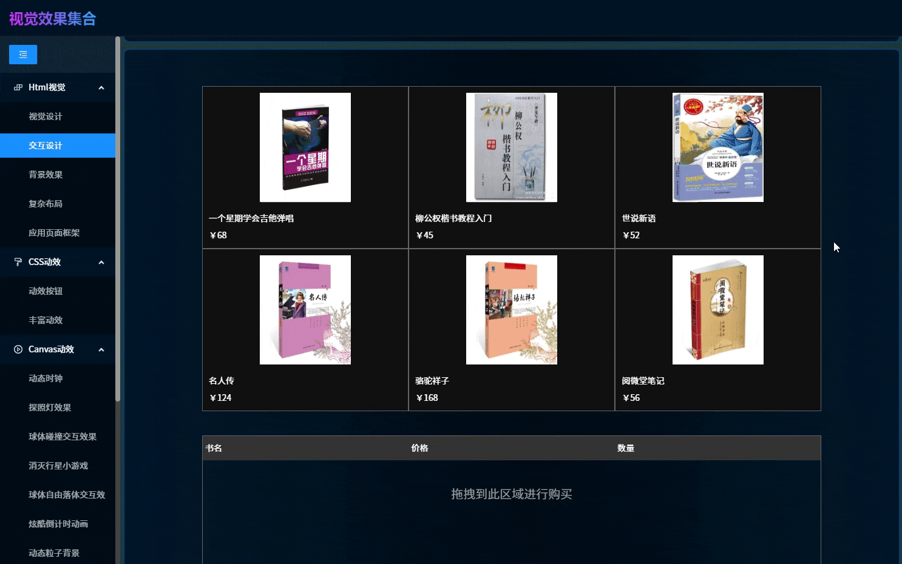
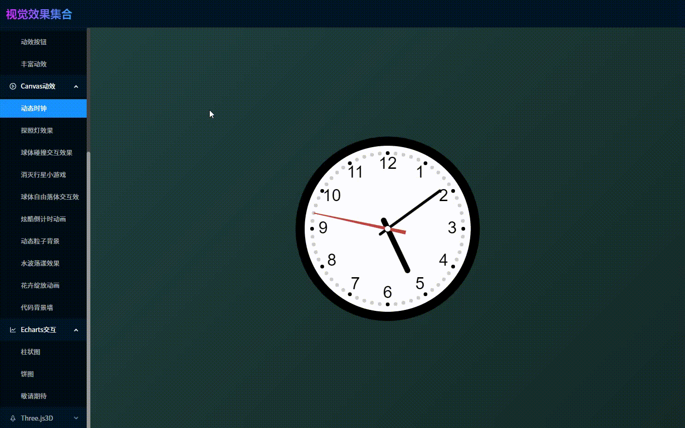
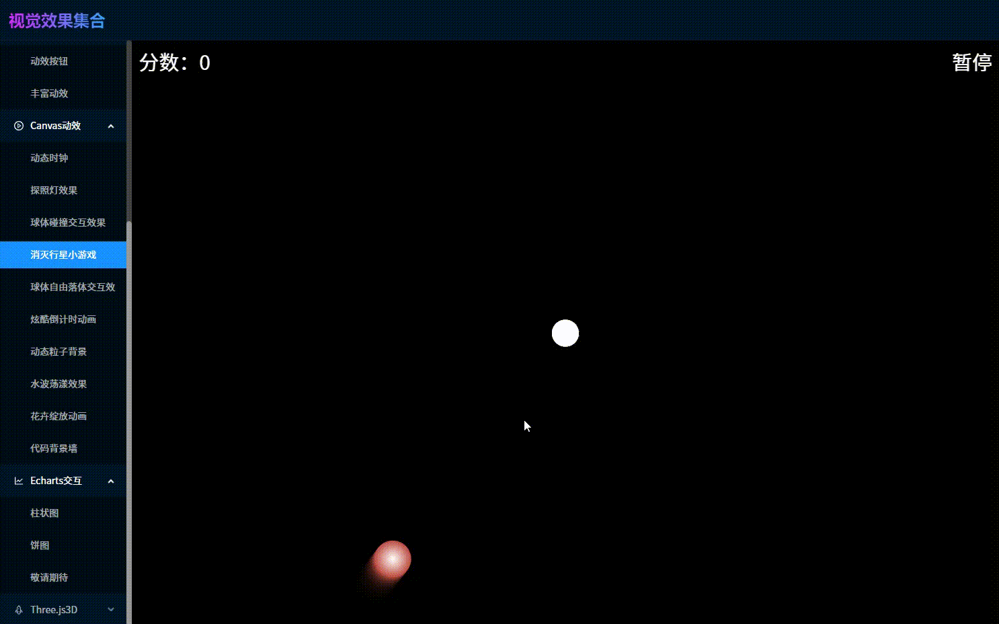
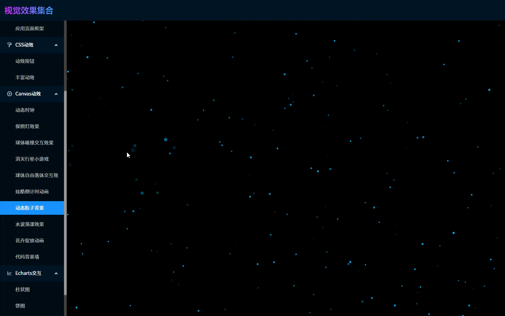
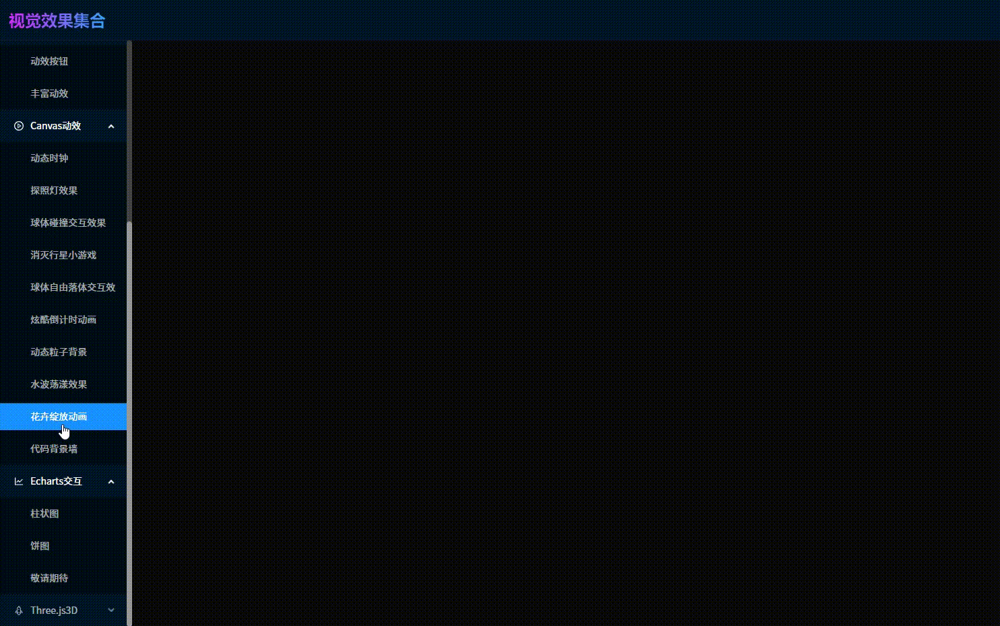
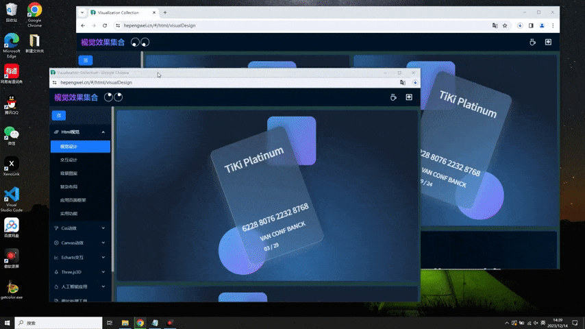

<h1 align="center">visualization-collection</h1>

一个专注于前端视觉效果的集合应用，包含CSS动效、Canvas动画、Three.js3D、人工智能应用等上百个案例（持续更新）

## 在线体验(PC端)
#### 体验地址：[http://hepengwei.cn](http://hepengwei.cn)

#### Vue版本：[https://github.com/hepengwei/visualization-collection-vue](https://github.com/hepengwei/visualization-collection-vue)
 

## 应用展示(部分效果)
* 视觉设计

* 交互设计

* Canvas动效

* 量子纠缠效果(隐藏款)

## 持续更新，敬请关注
